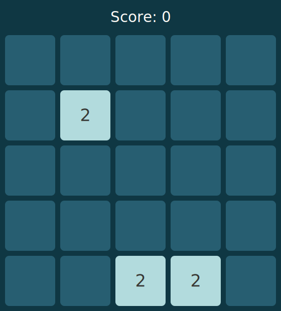

# 2048-readme-engine

Engine for running 2048 on user Github profiles' README.md.

Welcome to the 2048 game on GitHub!

To play, open an issue with the title `MOVE: [DIRECTION]`, where `[DIRECTION]` can be `U`, `D`, `L`, or `R`.

## Current Game Board

<table align="center">
  <tr>
    <td width="60%">
      
    </td>
    <td align="center">
        <h2 align="center">Controls</h2>
        

          
        

        

          
          &nbsp;&nbsp;&nbsp;&nbsp;
          
        

        

          
        

    </td>
  </tr>
</table>

## Recent Moves

<!--START_RECENT_MOVES_TABLE-->
<!--END_RECENT_MOVES_TABLE-->

## Top 5 Highest Scorers

<!--START_TOP_SCORERS_TABLE-->
<!--END_TOP_SCORERS_TABLE-->
