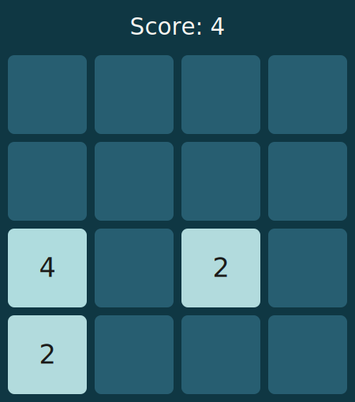

# 2048-readme-engine

**Welcome to the 2048 game on GitHub! By Joel Baldapan**

_This is an engine for running 2048 on user Github profiles' README.md._

## Game

### 🕹️ Current Game Board

<table align="center">
  <tr>
    <td width="50%">
      
    </td>
    <td align="center">
        <h4 align="center">Controls</h4>
        <p align="center">
          <a href="https://github.com/joelbaldapan/joelbaldapan/issues/new?title=MOVE%3A%20U&body=%23%23%20[2048%20Game%20on%20Github](https%3A%2F%2Fgithub.com%2Fjoelbaldapan%2F)%0A%0AInstructions%3A%0A-%20Important%3A%20Please%20do%20not%20edit%20the%20Issue%20Title%20above!%0A-%20Click%20the%20%60Create%60%20button%20to%20submit%20your%20move.%0A-%20Return%20to%20the%20[gameboard](https%3A%2F%2Fgithub.com%2Fjoelbaldapan%2F)%2C%20and%20refresh%20the%20page%20until%20it%20updates.">
            
          </a>
        </p>
        <p align="center">
          <a href="https://github.com/joelbaldapan/joelbaldapan/issues/new?title=MOVE%3A%20L&body=%23%23%20[2048%20Game%20on%20Github](https%3A%2F%2Fgithub.com%2Fjoelbaldapan%2F)%0A%0AInstructions%3A%0A-%20Important%3A%20Please%20do%20not%20edit%20the%20Issue%20Title%20above!%0A-%20Click%20the%20%60Create%60%20button%20to%20submit%20your%20move.%0A-%20Return%20to%20the%20[gameboard](https%3A%2F%2Fgithub.com%2Fjoelbaldapan%2F)%2C%20and%20refresh%20the%20page%20until%20it%20updates.">
            
          </a>
          &nbsp;&nbsp;&nbsp;&nbsp;
          <a href="https://github.com/joelbaldapan/joelbaldapan/issues/new?title=MOVE%3A%20R&body=%23%23%20[2048%20Game%20on%20Github](https%3A%2F%2Fgithub.com%2Fjoelbaldapan%2F)%0A%0AInstructions%3A%0A-%20Important%3A%20Please%20do%20not%20edit%20the%20Issue%20Title%20above!%0A-%20Click%20the%20%60Create%60%20button%20to%20submit%20your%20move.%0A-%20Return%20to%20the%20[gameboard](https%3A%2F%2Fgithub.com%2Fjoelbaldapan%2F)%2C%20and%20refresh%20the%20page%20until%20it%20updates.">
            
          </a>
        </p>
        <p align="center">
          <a href="https://github.com/joelbaldapan/joelbaldapan/issues/new?title=MOVE%3A%20D&body=%23%23%20[2048%20Game%20on%20Github](https%3A%2F%2Fgithub.com%2Fjoelbaldapan%2F)%0A%0AInstructions%3A%0A-%20Important%3A%20Please%20do%20not%20edit%20the%20Issue%20Title%20above!%0A-%20Click%20the%20%60Create%60%20button%20to%20submit%20your%20move.%0A-%20Return%20to%20the%20[gameboard](https%3A%2F%2Fgithub.com%2Fjoelbaldapan%2F)%2C%20and%20refresh%20the%20page%20until%20it%20updates.">
            
          </a>
        </p>
    </td>
  </tr>
</table>

### Statistics

<details open><summary>🏆️ Top 5 Scorers</summary>
 
<!--START_TOP_SCORERS_TABLE-->
| Rank | Username | Total Score |
|---|---|---|
| 1 | [@joelbaldapan](https://github.com/joelbaldapan) | 4 |
<!--END_TOP_SCORERS_TABLE-->

</details>

<details><summary>🕙️ Recent Moves</summary>

<!--START_RECENT_MOVES_TABLE-->
| Username | Score Earned |
|---|---|
| [@joelbaldapan](https://github.com/joelbaldapan) | +0 |
| [@joelbaldapan](https://github.com/joelbaldapan) | +4 |
<!--END_RECENT_MOVES_TABLE-->

</details>

## Steps to make your own repo
1. **Fork or Clone This Repo**
  - Fork: Click "Fork" on GitHub
  - Clone: run `git clone https://github.com/joelbaldapan/2048-readme-engine.git`.

2. **Set Up GitHub Actions**
  - Navigate to `Settings -> Actions -> General`
  - Scroll down to Workflow permissions
  - Enable Read `repository contents and packages permissions`.

3. **Configure Workflow**
  - The workflow file is at `.github/workflows/2048_bot.yml`.
  - You can customize it as needed.

4. **Replace README.md Redirects**
  - You may use the template for your README.md as shown above.
  - For each button, however, make sure to **update the following links**:
    - `https://github.com/joelbaldapan/joelbaldapan` to *your* repository.
  - These links can either be **removed or updated to link your repository**:
    - `[2048%20Game%20on%20Github](https%3A%2F%2Fgithub.com%2Fjoelbaldapan%2F)`
    - `[gameboard](https%3A%2F%2Fgithub.com%2Fjoelbaldapan%2F)`

5. **Push Your Changes**
  - Commit and push to your repository.

6. **Play the Game**
  - Create issues in your repo using the format `MOVE: U`, `MOVE: D`, `MOVE: L`, or `MOVE: R` to play.
  - Or, you may use the buttons on your README.md.

7. **Check Your README**
  - The board and leaderboards will update automatically after each move.
  - Have fun!

You can also further customize the game logic, board size, or visuals by editing files in the `game/config.py` directory.


## Technical Overview

### How It Works

- Users interact by creating GitHub issues with move commands (`MOVE: U`, `MOVE: D`, etc.).
- A GitHub Actions workflow parses the issue, runs the game engine, and updates the board and statistics.
  - More specifically, it runs two commands within the project:
    1. `python main.py <username> <command>`
    2. `python update_readme.py`
- After this, it commits and pushes the updated repository.
- The board image and leaderboards are dynamically updated in the README.

### File Structure

```
.
├── assets
│   ├── fonts/
│   └── images/
├── data
│   ├── board
│   │   ├── history/
│   │   └── boardN.svg
│   ├── state
│   │   ├── history/
│   │   └── game.json
│   └── stats
│       ├── global_stats.json
│       └── users.json
├── game
|   ├── __init__.py
│   ├── config.py
│   ├── controllers
│   │   ├── __init__.py
│   │   └── controller.py
│   ├── models
│   │   ├── __init__.py
│   │   ├── game_board.py
│   │   ├── global_stats.py
│   │   └── user_stats.py
│   ├── utils
│   │   ├── __init__.py
│   │   └── file_utils.py
│   └── views
│       ├── __init__.py
│       └── view.py
├── main.py
├── pyproject.toml
├── README.md
├── requirements.txt
└── update_readme.py
```

This project has three main directories.

- `assets/`: Stores the fonts and images.
- `data/` Stores the game state and board, as well as the history of previous games.
- `game/` Stores all the game logic.

Important files are:

- `.github/workflows/2048_bot.yml`: GitHub Actions workflow for automation.
- `main.py`: Entry point for running moves and resets.
- `update_readme.py`: Updates the README with the latest board and stats.

### Game Architecture

The 2048 game uses the Model-View-Controller (MVC) pattern:

- **Model:** Handles game state, user statistics, and global statistics.
- **View:** Renders the board in SVG and console formats.
- **Controller:** Manages moves, resets, and updates between model and view.

### Data Storage

- Game state: `data/state/game.json`
- Board images: `data/board/boardN.svg`
- User stats: `data/stats/users.json`
- Global stats: `data/stats/global_stats.json`.

Finished games are automatically archived inside the following directories in this format `<file>_yyyymmdd-HHMMSS.<ext>`:
- `data/board/history/`
- `data/state/history`

## License
This project and its code are released under the [MIT License](LICENSE).

If you use or adapt it in your own repositories, a link back to this repo would be greatly appreciated! :D  
**Thank you for visiting 2048 GitHub!**